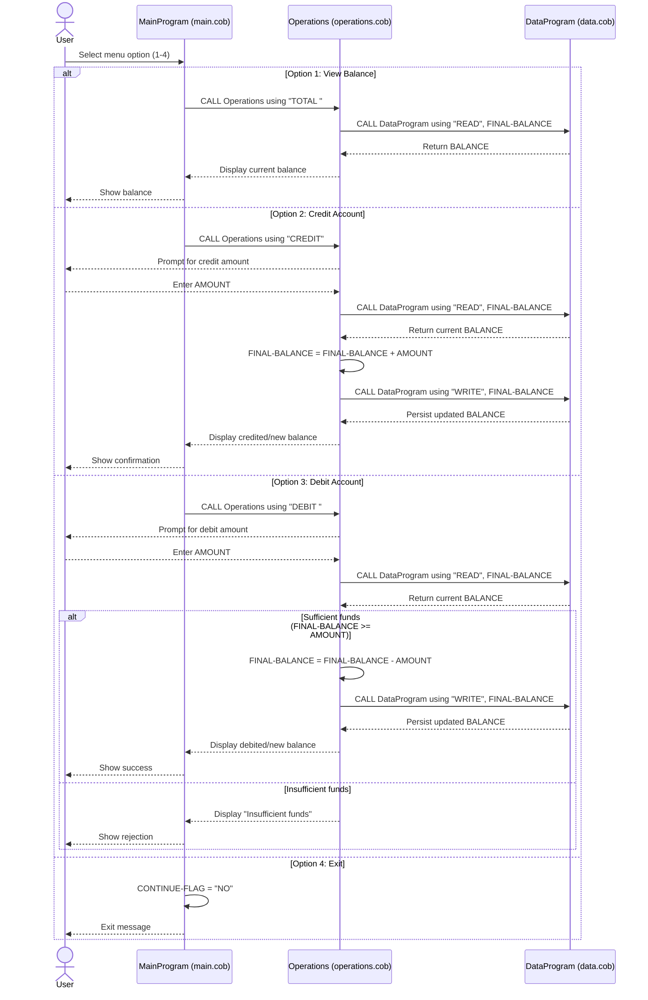

# COBOL Student Account Documentation

This document explains the purpose of each COBOL file in `src/cobol`, the key operations implemented, and the business rules used for student account balance handling.

## Overview

The system is a simple menu-driven student account manager with three programs:

- `MainProgram` (`main.cob`) handles user interaction and menu navigation.
- `Operations` (`operations.cob`) executes account actions (view, credit, debit).
- `DataProgram` (`data.cob`) acts as the balance storage layer.

Program call chain:

1. `MainProgram` accepts the user choice.
2. `MainProgram` calls `Operations` with an operation code.
3. `Operations` calls `DataProgram` to read or write the persisted balance.

## File-by-File Purpose and Key Functions

### `src/cobol/main.cob` (`PROGRAM-ID. MainProgram`)

Purpose:
- Entry point for the application.
- Presents a looped menu until the user chooses to exit.

Key logic:
- Displays options:
  - `1` View Balance
  - `2` Credit Account
  - `3` Debit Account
  - `4` Exit
- Maps user choices to operation codes passed to `Operations`:
  - `1` -> `TOTAL `
  - `2` -> `CREDIT`
  - `3` -> `DEBIT `
- Validates menu input at a basic level (`WHEN OTHER` shows an invalid choice message).
- Ends loop only when choice `4` sets `CONTINUE-FLAG` to `NO`.

### `src/cobol/operations.cob` (`PROGRAM-ID. Operations`)

Purpose:
- Business operation layer for account transactions.
- Converts high-level action requests into balance updates.

Key logic:
- Receives `PASSED-OPERATION` from `MainProgram`.
- Supports three operations:
  - `TOTAL `
    - Calls `DataProgram` with `READ`.
    - Displays current balance.
  - `CREDIT`
    - Prompts for amount.
    - Reads balance via `DataProgram` (`READ`).
    - Adds amount.
    - Persists updated balance via `DataProgram` (`WRITE`).
    - Displays new balance.
  - `DEBIT `
    - Prompts for amount.
    - Reads balance via `DataProgram` (`READ`).
    - Applies available-funds check before subtraction.
    - Writes updated balance only when funds are sufficient.
    - Displays either success or insufficient funds message.

### `src/cobol/data.cob` (`PROGRAM-ID. DataProgram`)

Purpose:
- Data persistence abstraction for account balance.
- Owns and updates the internal stored balance value.

Key logic:
- Uses `STORAGE-BALANCE` (`PIC 9(6)V99`) initialized to `1000.00`.
- Accepts command through `PASSED-OPERATION` and value via `BALANCE` in linkage:
  - `READ` -> copies internal `STORAGE-BALANCE` to `BALANCE`.
  - `WRITE` -> copies provided `BALANCE` into `STORAGE-BALANCE`.
- Returns control with `GOBACK` after operation.

## Student Account Business Rules

The following business rules are implemented in the current COBOL code:

1. **Default opening balance**
   - Student account starts at `1000.00` (in-memory storage variable in `DataProgram`).

2. **Allowed actions**
   - Students can view balance, credit funds, and debit funds.

3. **No overdraft rule**
   - Debit is allowed only when `FINAL-BALANCE >= AMOUNT`.
   - If not, transaction is rejected with `Insufficient funds for this debit.`

4. **Read-before-update rule**
   - All credit/debit operations first read the latest stored balance before computing a new one.

5. **Write-on-success rule (debit)**
   - Debit updates are persisted only when the funds check passes.

6. **Session-scoped persistence**
   - Balance is stored in working storage, not an external database/file.
   - Balance persists only for the lifetime of the running process.

## Notes and Constraints

- Operation codes are fixed-width strings (`PIC X(6)`), so values include trailing spaces where needed (`TOTAL ` and `DEBIT `).
- Amount and balance fields are numeric with two implied decimal places (`PIC 9(6)V99`).
- Current implementation does not include validation for negative inputs or non-numeric amount entry; additional guard logic may be needed for production-grade student finance workflows.

## Sequence Diagram (Data Flow)

